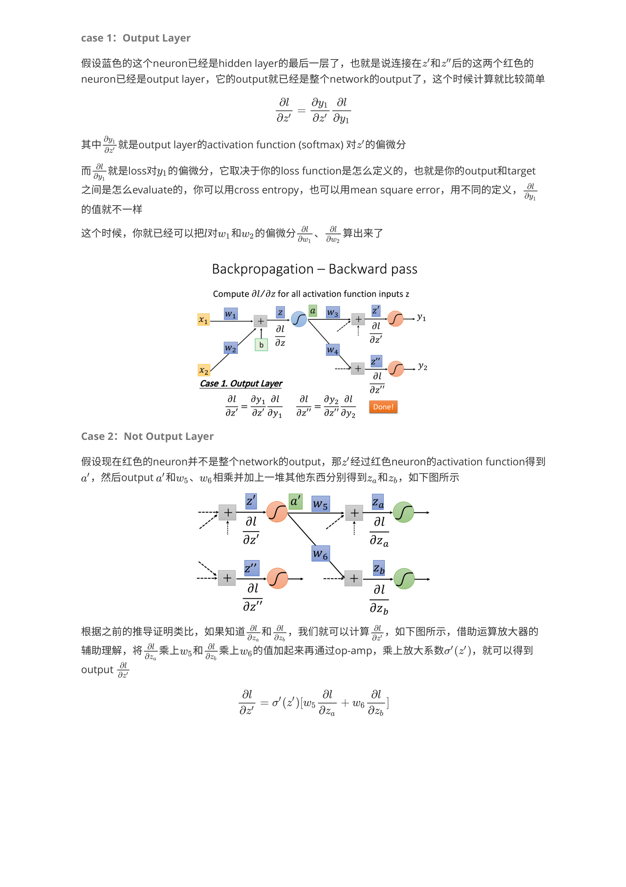

## Content

This post is to introduce the backpropagation in details. Backpropagation, in other words, is based on total differential formula and chain rule, which has a forward pass and a backward pass. The gradient for each weight (wi) is obtained by multiplying the partial derivatives from two passes.

Reference: <a href="./lecture.pdf">Backpropagation slides</a>.
Note credit: [Sakura-gh](https://sakura-gh.github.io/ML-notes/ML-notes-html/9_Backpropagation.html).

<figure>
  
</figure>
<figure>
  
</figure>
<figure>
  
</figure>
<figure>
  
</figure>
<figure>
  
</figure>
<figure>
  
</figure>
<figure>
  
</figure>
<figure>
  
</figure>
