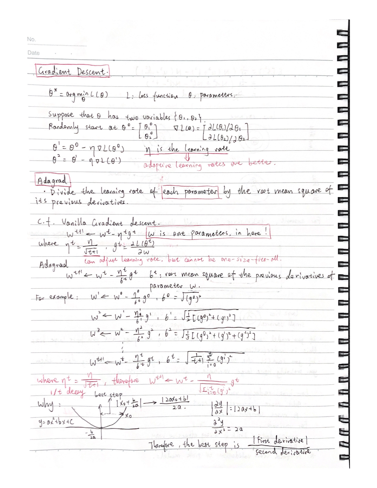
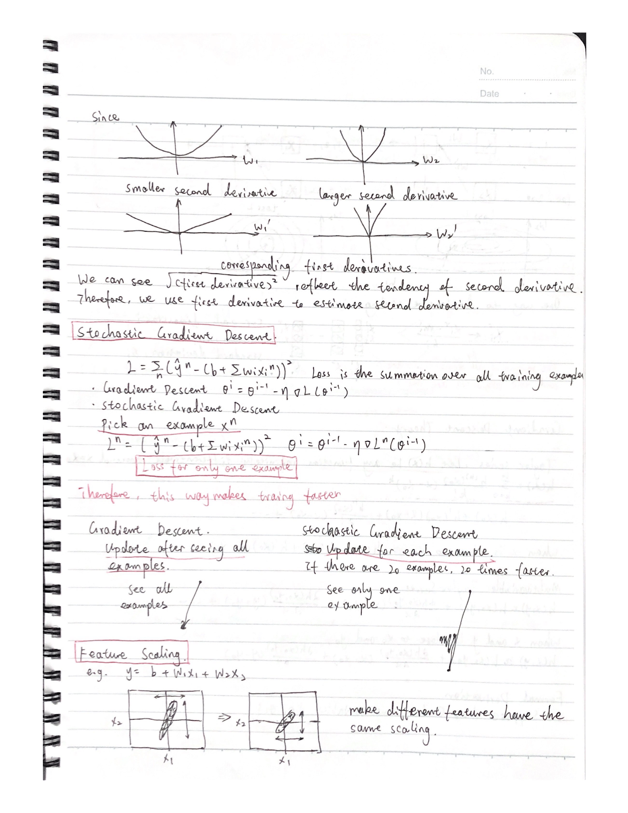
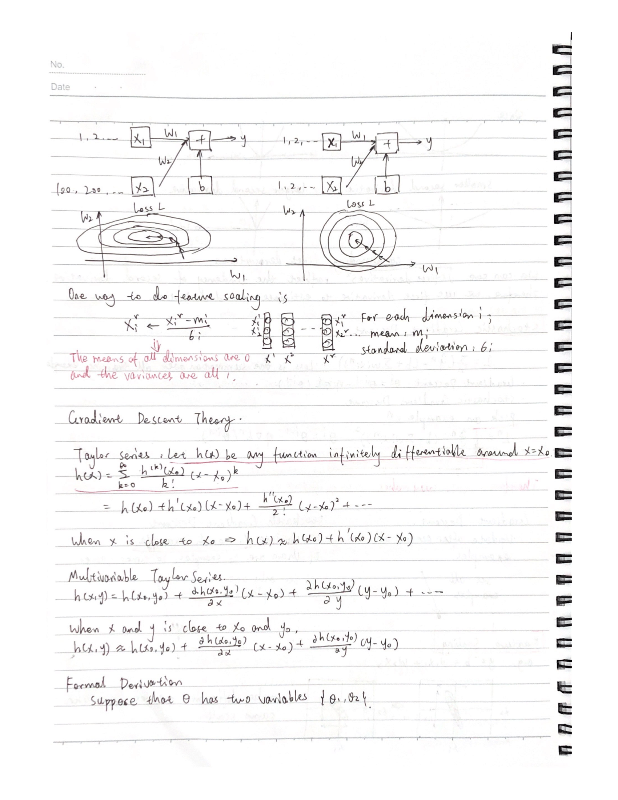
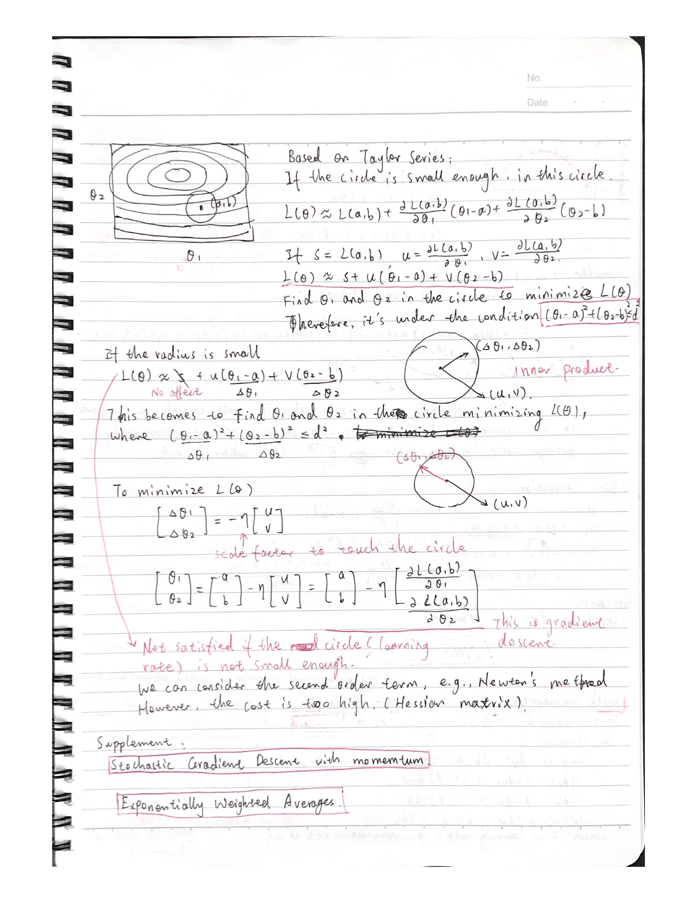
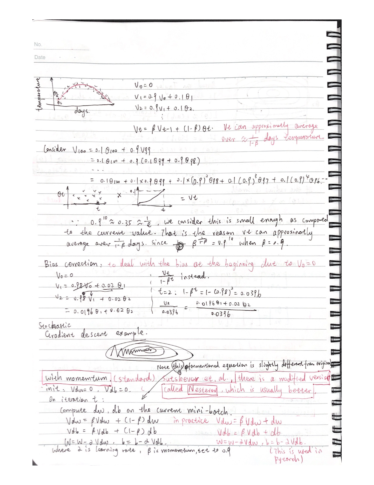
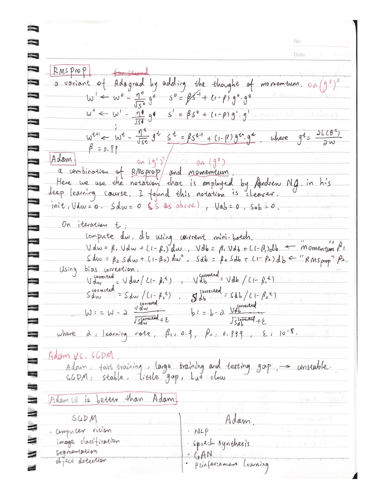

## Content

This post is to sort out the optimization methods in deep learning from the most basic idea about what is <b>gradient descent</b> to the most popular optimizer - <b>Adam</b>. Moreoever, the <b>SGD</b>, <b>SGDM</b>, <b>Adagrad</b>, <b>PMSProp</b> and some recent advances such as <b>AdamW</b> are introduced. Hope this post could give me some hints about how to choose different optimizers to train the neural network.

Reference: <a href="./lecture.pdf">Optimization slides</a>, <a href="./tutorial.pdf">Tutorial</a>.

<figure>
  
  <figcaption>
Page 1
</figcaption>
</figure>
<figure>
  
  <figcaption>
Page 2
</figcaption>
</figure>
<figure>
  
  <figcaption>
Page 3
</figcaption>
</figure>
<figure>
  
  <figcaption>
Page 4
</figcaption>
</figure>
<figure>
  
  <figcaption>
Page 5
</figcaption>
</figure>
<figure>
  
  <figcaption>
Page 6
</figcaption>
</figure>
